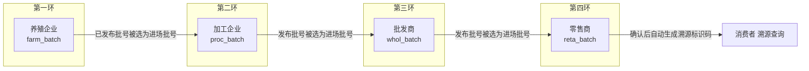
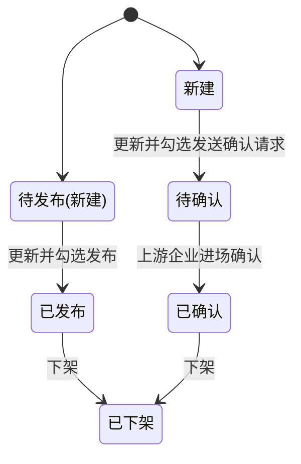
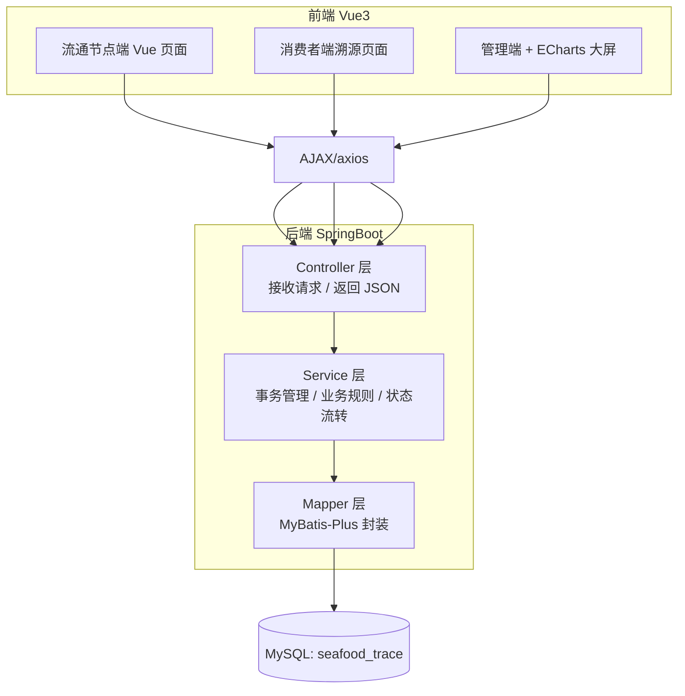
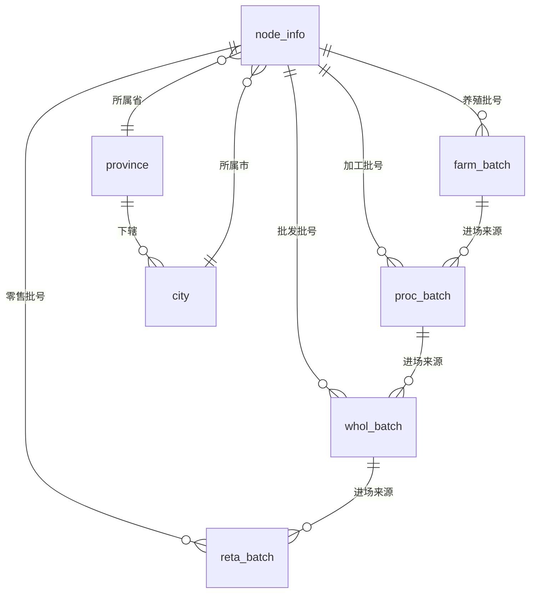

# 冷冻海产品溯源系统 开发文档

> 项目名称：冷冻海产品溯源平台（Frozen Seafood Traceability System）
> 文档类型：实践项目开发设计文档
> 参考依据：东软《食品溯源平台》实践任务书（肉类场景，本文档已改造为冷冻海产品场景）
> 技术栈：SpringBoot + MyBatis-Plus + MySQL + Vue3

---

## 1. 引言

### 1.1 编写目的

本文档用于指导"冷冻海产品溯源系统"的**需求分析、系统设计、数据库设计、编码与调试**全过程，是团队协作开发、代码评审以及撰写实践报告 / 答辩 PPT 的依据。

本系统围绕"**水产养殖企业 → 冷冻海产品加工企业 → 批发商 → 零售商 → 消费者**"的完整流通链条，记录每一批次冷冻海产品的来源与流转信息，最终以"**溯源标识码**"的形式向消费者提供全程可追溯查询。

### 1.2 项目目标

- 强化对 **SpringBoot + MyBatis-Plus + Vue3 前后端分离** 项目的需求分析、系统设计、编码与调试能力；
- 掌握复杂程序的**模块划分、数据结构定义、模块接口设计、模块流程设计**能力；
- 建立冷冻海产品"从养殖场到餐桌"的可信溯源数据链；
- 具备初步的工程技术文档写作与答辩表达能力。

### 1.3 术语与角色定义

| 术语       | 说明                                                                           |
| ---------- | ------------------------------------------------------------------------------ |
| 节点企业   | 参与溯源链流转的企业，包括养殖企业、加工企业、批发商、零售商                   |
| 产品批号   | 各节点企业原有业务系统中生成的一批产品的编号，本系统中人工录入并与上游批号关联 |
| 进场信息   | 下游企业采购上游企业某产品批号形成本批次的原料来源信息                         |
| 进场确认   | 下游企业发起的确认请求，由上游企业确认后，下游批号状态由"待确认"变更为"已确认" |
| 溯源标识码 | 零售商产品批号状态为"已确认"时，系统自动生成的溯源唯一码，供消费者查询         |

系统角色一览：

| 角色       | 说明                                                               |
| ---------- | ------------------------------------------------------------------ |
| 养殖企业   | 水产养殖 / 捕捞企业，产出初级水产品，向加工企业供货                |
| 加工企业   | 冷冻海产品加工厂，将养殖水产品加工为冷冻海产品                     |
| 批发商     | 海产品批发流通环节，向零售商供货                                   |
| 零售商     | 终端销售环节（商超 / 水产零售 / 电商），其批号确认后自动生成溯源码 |
| 消费者     | 通过溯源码查询批次全链条信息的普通公众                             |
| 系统管理员 | 管理端，负责节点企业注册信息管理与数据统计大屏                     |

### 1.4 参考文档与来源

- 东软实践任务书《食品溯源平台》（改造前为肉类场景：养殖→屠宰→批发→零售）
- 本仓库工程文件（`pom.xml`、`src/main/java/com/example`）

---

## 2. 总体需求

### 2.1 技术架构

| 层面     | 技术选型                                                        |
| -------- | --------------------------------------------------------------- |
| 开发语言 | JDK8（任务书要求；本仓库脚手架已按 Java 17 初始化，可兼容调整） |
| 后端框架 | SpringBoot、MyBatis-Plus                                        |
| 数据库   | MySQL（如 mysql-5.5.62-winx64，数据库名建议 `seafood_trace`）   |
| 前端框架 | Vue3（Vue-Cli）                                                 |
| 数据交互 | AJAX / Axios，服务端 JSON 数据转换                              |
| 可视化   | ECharts                                                         |

### 2.2 开发工具与环境

- IDE：VsCode（前端 Vue3）、STS（SpringToolSuite4，后端）
- 构建工具：Maven
- 数据库客户端：Navicat / MySQL Workbench

### 2.3 涉及技术点

- AJAX 的使用（前后端交互）
- SpringBoot 框架的使用（Controller / Service / 配置）
- MyBatis-Plus 框架的使用（封装 Mapper、Service 层事务管理、数据层批量操作）
- 多对一、一对多、多对多关系映射
- 服务端 JSON 数据转换
- Vue-Cli 的使用（工程化、路由、组件）
- 多条件模糊查询、分页查询的使用
- ECharts 可视化大屏
- 跨域配置（WebMvcConfig）

---

## 3. 业务流程分析

### 3.1 总体业务流程

本系统的核心是一条从上游到下游逐级"进场—确认"的批号溯源链：



业务流转规则：

1. **养殖企业**：新建产品批号（待发布）→ 更新并选择发布（已发布）→ 下游加工企业以其为进场批号创建自己的批号。
2. **加工企业**：选择上游养殖企业批号作为"进场信息"并新建自己的产品批号（新建）→ 更新并勾选"向上游企业发送确认请求"（待确认）→ **养殖企业进场确认**（已确认，此时冷冻海产品加工批号正式进入溯源链）。
3. **批发商**：进场批号来自加工企业；流程同加工企业。
4. **零售商**：进场批号来自批发商；状态为"已确认"时系统自动生成**溯源标识码**。
5. **消费者**：凭零售商处获得的溯源码查询整条链条（养殖企业→加工企业→批发商→零售商）。

> 说明：原任务书中"屠宰企业"环节在本系统中替换为"冷冻海产品加工企业"，"肉类检验检疫"对应改造为"水产品检验检疫 / 出厂合格证明"，其余流程与状态机保持一致。

### 3.2 产品批号状态机

| 环节     | 状态集合                        | 状态说明                                        |
| -------- | ------------------------------- | ----------------------------------------------- |
| 养殖企业 | 待发布 → 已发布 → 已下架        | 待发布可更新 / 删除；已发布可被下游选用，可下架 |
| 加工企业 | 新建 → 待确认 → 已确认 → 已下架 | 待确认=已向上游发送确认请求；上游确认后转已确认 |
| 批发商   | 新建 → 待确认 → 已确认 → 已下架 | 同上                                            |
| 零售商   | 新建 → 待确认 → 已确认 → 已下架 | 转"已确认"时自动生成溯源码                      |



### 3.3 溯源标识码生成规则（建议）

零售商产品批号被上游（批发商）确认、状态置为"已确认"时自动生成，建议规则：

```
溯源标识码 = 产品批号散列(短码) + 生成时间 + 序号
```

示例：`TSF-20260902-XXXXXX`。要求全局唯一，保存到 `reta_batch.trace_code`，提供唯一索引。

---

## 4. 功能需求（用例说明）

### 4.0 总体功能结构

| 端                                      | 子功能                                                                                                                           |
| --------------------------------------- | -------------------------------------------------------------------------------------------------------------------------------- |
| 流通节点端（养殖 / 加工 / 批发 / 零售） | 登录、功能菜单、更新密码、退出登录、创建 / 浏览 / 删除 / 更新 / 下架产品批号、浏览批号详情、向上游发送确认请求、下游企业进场确认 |
| 消费者端                                | 输入溯源标识码获取溯源信息                                                                                                       |
| 系统管理端                              | 节点企业注册信息管理（增删改查 + 模糊查询 + 分页）、注册信息统计大屏                                                             |

### 4.1 流通节点端共通功能

#### 4.1.1 登录用例

- **应用场景**：养殖企业、加工企业、批发商、零售商登录系统。
- **操作描述**：四类企业共用一个登录入口，输入"登录编码 + 登录密码"，登录成功后根据角色类型跳转到各自的功能菜单页面。
- **页面原型（文字描述）**：登录页含企业登录编码输入框、密码输入框、登录按钮；初始化时默认展示登录页。
- **事件描述**：

| 事件对象 | 事件   | 动作                                               |
| -------- | ------ | -------------------------------------------------- |
| 登录页面 | 初始化 | 系统启动后默认显示登录页面                         |
| 登录按钮 | Click  | 校验登录编码与密码，成功后按角色跳转对应功能菜单页 |

#### 4.1.2 功能菜单用例

- **应用场景**：登录成功后进入各角色主页面进行功能导航。
- **操作描述**：展示当前登录企业信息（企业名称、企业类型），以及该角色可用的功能入口。
- **功能按钮差异**：

| 角色     | 功能按钮                                     |
| -------- | -------------------------------------------- |
| 养殖企业 | 新建产品批号、产品批号管理、下游企业进场确认 |
| 加工企业 | 新建产品批号、产品批号管理、下游企业进场确认 |
| 批发商   | 新建产品批号、产品批号管理、下游企业进场确认 |
| 零售商   | 新建产品批号、产品批号管理                   |

- **事件描述**：

| 事件对象     | 事件   | 动作                                           |
| ------------ | ------ | ---------------------------------------------- |
| 功能菜单页面 | 初始化 | 查询并展示当前登录企业名称与类型，显示功能入口 |
| 功能按钮     | Click  | 跳转到对应的功能页面                           |

#### 4.1.3 更新密码用例

| 事件对象     | 事件   | 动作                                   |
| ------------ | ------ | -------------------------------------- |
| 更新密码页面 | 初始化 | 点击底部导航"更新密码"进入更新密码页面 |
| 更新密码按钮 | Click  | 校验旧密码并更新登录密码               |
| 退出登录按钮 | Click  | 退出登录，跳转登录页面                 |

### 4.2 养殖企业端功能要求

#### 4.2.1 创建产品批号

- **应用场景**：养殖企业一批水产品出场时创建产品批号。
- **操作描述**：点击"新建"按钮创建；产品批号来自养殖企业原有管理系统，需手动输入，并做**唯一性校验（Blur 触发）**。
- **表单元素**：产品批号、产品品种、检验检疫合格证明、官方检疫员名称、新建按钮。
- **事件描述**：

| 事件对象       | 事件   | 动作                           |
| -------------- | ------ | ------------------------------ |
| 新建页面       | 初始化 | 显示养殖企业新建产品批号表单   |
| 产品批号输入框 | Blur   | 检查产品批号是否已存在         |
| 新建按钮       | Click  | 执行新建操作，状态置为"待发布" |

#### 4.2.2 浏览产品批号列表

- **状态规则**：养殖企业批号有"待发布（新建）/ 已发布 / 已下架"三种状态；**已下架批号不可浏览**。
- 待发布列表项提供"更新、删除"按钮；已发布列表项仅提供"下架"按钮。
- **显示内容**：产品批号、品种、检验检疫合格证明。
- **事件描述**：

| 事件对象       | 事件   | 动作                                  |
| -------------- | ------ | ------------------------------------- |
| 浏览批号页面   | 初始化 | 查询"待发布"批号列表并显示            |
| 待发布单选按钮 | Click  | 查询待发布列表（显示更新 / 删除按钮） |
| 已发布单选按钮 | Click  | 查询已发布列表（显示下架按钮）        |
| 更新按钮       | Click  | 跳转更新页面                          |
| 删除按钮       | Click  | 删除该产品批号                        |
| 列表行         | Click  | 跳转产品批号详情页                    |

#### 4.2.3 更新产品批号

- 更新表单中**产品批号禁用**，字段含：产品批号、产品品种、检验检疫合格证明、官方检疫员名称、是否发布（复选框）、更新按钮。
- 更新按钮动作：保存修改；**若勾选"是否发布"，则将状态更新为"已发布"**。

#### 4.2.4 下架产品批号

- 已发布列表"下架"按钮：将状态更新为"已下架"。

#### 4.2.5 浏览产品批号详情

- 详情页初始化时按 id 查询单条批号并展示。

#### 4.2.6 下游企业进场确认（确认加工企业批号）

- **应用场景**：养殖企业的下游是加工企业，需对其进场确认请求处理。
- **操作描述**：查询**进场产品批号为当前养殖企业批号且状态为"待确认"**的加工企业批号列表；支持按加工企业名称模糊查询；点击"确认"将状态更新为"已确认"。
- **事件描述**：

| 事件对象     | 事件   | 动作                           |
| ------------ | ------ | ------------------------------ |
| 进场确认页面 | 初始化 | 查询符合条件的加工企业批号列表 |
| 查找按钮     | Click  | 按加工企业名称模糊查询         |
| 确认按钮     | Click  | 将该批号状态更新为已确认       |

### 4.3 加工企业端功能要求

> 加工企业是链条中"承上启下"的关键环节：向上游（养殖企业）购买原料水产品，向下游（批发商）供货冷冻海产品。

#### 4.3.1 创建产品批号

- **应用场景**：加工企业一批冷冻海产品出厂时创建产品批号。
- **操作描述**：新建页初始化查询省信息；产品批号需手动输入并做唯一性校验。
- **表单元素**：

| 分组                      | 字段                                                                         |
| ------------------------- | ---------------------------------------------------------------------------- |
| 本批号信息                | 产品批号、产品名称（冷冻海产品）、产品类型、检验检疫合格证明、官方检验员名称 |
| 进场信息-养殖企业所在区域 | 省 / 市 下拉级联                                                             |
| 进场信息-养殖企业名称     | 下拉列表（随省市联动）                                                       |
| 进场信息-养殖企业产品批号 | 下拉列表（随企业联动）                                                       |
| 进场信息-养殖企业产品品种 | 输入框（禁用，随所选批号回填）                                               |

- **事件描述**：

| 事件对象             | 事件   | 动作                                   |
| -------------------- | ------ | -------------------------------------- |
| 新建页面             | 初始化 | 显示表单并查询省信息填充省下拉列表     |
| 产品批号输入框       | Blur   | 校验产品批号是否已存在                 |
| 省下拉列表           | Change | 查询该省下市信息并填充市下拉           |
| 市下拉列表           | Change | 查询该省该市下养殖企业并填充企业下拉   |
| 养殖企业名称下拉     | Change | 查询该企业已发布产品批号并填充批号下拉 |
| 养殖企业产品批号下拉 | Change | 回填其产品品种到禁用输入框             |
| 新建按钮             | Click  | 执行新建操作，状态置为"新建"           |

> 批发商 / 零售商的新建页面交互与本节完全一致，仅把"养殖企业"替换为其各自的上游企业（批发商上游=加工企业，零售商上游=批发商），此处不再重复。

#### 4.3.2 浏览产品批号列表 / 删除 / 下架

- **状态**：加工企业批号有"新建 / 待确认 / 已确认 / 已下架"四种状态，**已下架不可浏览**。
- 按状态分 tab（单选）浏览：新建（含更新、删除按钮）、待确认、已确认（含下架按钮）。
- 列表显示：产品批号、产品名称（品种）、进场批号。
- 删除、下架、详情用例同养殖企业（删除只允许"新建"状态）。

#### 4.3.3 更新产品批号

- 更新表单**产品批号禁用**，其余字段与新建一致，另含"**是否向上游企业发送确认请求**（复选框）"。
- 更新按钮动作：保存修改；若勾选发送确认请求，则状态更新为"**待确认**"。

#### 4.3.4 下游企业进场确认（确认批发商批号）

- 查询条件：进场产品批号为当前加工企业批号且状态为"待确认"的批发商批号；支持按批发商名称模糊查询；确认后状态置为"已确认"。

### 4.4 批发商端功能要求

- 上游 = 加工企业，下游 = 零售商；
- 新建 / 浏览 / 更新 / 删除 / 下架 / 详情 / 上游发送确认请求 / 下游进场确认的交互与加工企业完全一致，仅替换上下游角色对象。
- 新建表单中进场批号选自**加工企业**的已发布批号，回填其产品名称（品种）。

### 4.5 零售商端功能要求

- 上游 = 批发商；新建 / 浏览 / 更新 / 删除 / 下架 / 详情流程同上。
- **差异点：详情用例**
  - 浏览批号详情页除展示本批号信息外，还要展示**溯源标识码**信息；
  - **当零售商产品批号状态为"已确认"时，系统自动生成溯源标识码**。

| 事件对象       | 事件   | 动作                               |
| -------------- | ------ | ---------------------------------- |
| 浏览批号详情页 | 初始化 | 查询批号信息与溯源标识码信息并展示 |

### 4.6 消费者端功能要求

- **输入溯源标识码获取溯源信息**
  - 应用场景：消费者根据产品包装上的溯源标识码查询冷冻海产品的全程溯源信息。
  - 操作描述：消费者端首页输入溯源码点击"溯源"按钮；溯源信息页面按链条展示：养殖企业 → 加工企业 → 批发商 → 零售商 各环节的企业名称、批号、品种、时间等信息。

| 事件对象               | 事件   | 动作                           |
| ---------------------- | ------ | ------------------------------ |
| 消费者端首页"溯源"按钮 | Click  | 跳转海产品溯源信息页面         |
| 溯源信息页面           | 初始化 | 依据溯源码查询并展示各节点信息 |

### 4.7 系统管理端功能要求

#### 4.7.1 节点企业注册信息管理

- **应用场景**：所有流通节点企业必须先在系统注册，否则无法进入溯源链。
- **操作描述**：对节点企业进行增删改查、模糊查询、分页（每页 10 条）。
  - **新建**：弹出对话框填写注册表单；
  - **列表**：页面初始化分页查询前 10 条；
  - **模糊查询 / 清空**：按企业名称、企业类型、所在省 / 市等条件组合查询，清空按钮重置；
  - **详情 / 编辑 / 删除**：表格操作列提供对应按钮；
  - **注意**：密码更新由节点企业在流通端自助完成，管理端编辑不处理密码。

| 事件对象   | 事件   | 动作                                                                          |
| ---------- | ------ | ----------------------------------------------------------------------------- |
| 管理页面   | 初始化 | 填充省 / 市下拉（无默认选中项），分页查询注册企业（每页 10 条）并填充分页组件 |
| 清空按钮   | Click  | 重置模糊查询表单                                                              |
| 查询按钮   | Click  | 按条件分页查询                                                                |
| 分页按钮组 | Click  | 上一页 / 下一页 / 页码 / 总行数                                               |
| 新建按钮   | Click  | 弹出新建对话框完成注册                                                        |
| 详情按钮   | Click  | 弹出详情对话框                                                                |
| 编辑按钮   | Click  | 弹出编辑对话框完成更新                                                        |
| 删除按钮   | Click  | 删除当前企业信息                                                              |

#### 4.7.2 节点企业注册信息统计（可视化大屏）

- 统计内容：
  1. **十二个月注册数量趋势** —— 折线图；
  2. **按省分组的注册数量分布** —— 饼图 / 柱状图；
  3. **按企业类型分组的注册数量分布** —— 饼图。
- 操作描述：页面初始化查询统计数据并以 **ECharts** 图表展示，直观反映系统应用状况。

---

## 5. 系统设计

### 5.1 总体架构



### 5.2 后端模块划分（建议）

```
src/main/java/com/example/...
├── NftTraceApplication.java        # 主启动类
├── config/WebMvcConfig.java        # 跨域等配置
├── common/Result.java              # 统一返回结果 + JSON 转换
├── entity/                         # 实体（对应各表）
│   ├── NodeInfo / FarmBatch / ProcBatch / WholBatch / RetaBatch
│   ├── Province / City / Admin
├── mapper/                         # MyBatis-Plus Mapper（含多表关联 / 统计 SQL）
├── service/ + impl/                # Service 接口与实现（事务、状态机规则）
├── controller/                     # REST Controller
│   ├── LoginController / NodeInfoController（共通 + 管理端）
│   ├── FarmBatchController / ProcBatchController / WholBatchController / RetaBatchController
│   ├── AreaController（省市级联）/ TraceController（消费者溯源）
│   └── StatsController（统计大屏）
```

### 5.3 数据库设计

#### 5.3.1 数据表一览

| 表名         | 说明                                        |
| ------------ | ------------------------------------------- |
| `node_info`  | 节点企业信息表（养殖 / 加工 / 批发 / 零售） |
| `farm_batch` | 养殖企业产品批号信息表                      |
| `proc_batch` | 加工企业产品批号信息表（冷冻海产品）        |
| `whol_batch` | 批发商产品批号信息表                        |
| `reta_batch` | 零售商产品批号信息表                        |
| `province`   | 省行政区域信息表                            |
| `city`       | 市行政区域信息表                            |
| `admin`      | 系统管理员表                                |

#### 5.3.2 节点企业信息表 `node_info`

| 字段                      | 类型        | 说明                                  |
| ------------------------- | ----------- | ------------------------------------- |
| id                        | bigint PK   | 主键                                  |
| node_code                 | varchar(32) | 登录编码（唯一）                      |
| password                  | varchar(64) | 登录密码（加密存储）                  |
| node_name                 | varchar(64) | 企业名称                              |
| node_type                 | tinyint     | 企业类型：1 养殖 2 加工 3 批发 4 零售 |
| province_code             | varchar(16) | 所在省编码（联 province）             |
| city_code                 | varchar(16) | 所在市编码（联 city）                 |
| contact / phone           | varchar(32) | 联系人 / 联系电话                     |
| status                    | tinyint     | 状态（启用 / 停用）                   |
| create_time / update_time | datetime    | 创建 / 更新时间                       |

> 原任务书中该环节的注册与统计逻辑、字段语义均可复用。市下拉与"省分组统计"需依赖本表的省、市编码。

#### 5.3.3 养殖企业产品批号 `farm_batch`

| 字段                      | 类型         | 说明                               |
| ------------------------- | ------------ | ---------------------------------- |
| id                        | bigint PK    | 主键                               |
| node_id                   | bigint       | 养殖企业 id（联 node_info）        |
| batch_code                | varchar(32)  | 产品批号（唯一，业务系统人工录入） |
| product_name              | varchar(64)  | 产品品种（如：南美白对虾、大黄鱼） |
| inspection_cert           | varchar(255) | 检验检疫合格证明                   |
| inspector                 | varchar(32)  | 官方检疫员名称                     |
| status                    | tinyint      | 1 待发布 / 2 已发布 / 3 已下架     |
| create_time / update_time | datetime     | 创建 / 更新时间                    |

#### 5.3.4 加工企业产品批号 `proc_batch`

| 字段                      | 类型         | 说明                                          |
| ------------------------- | ------------ | --------------------------------------------- |
| id                        | bigint PK    | 主键                                          |
| node_id                   | bigint       | 加工企业 id                                   |
| batch_code                | varchar(32)  | 产品批号（唯一）                              |
| product_name              | varchar(64)  | 产品名称 / 品种（冷冻海产品，如"冷冻带鱼段"） |
| product_type              | varchar(64)  | 产品类型（如整条 / 去头 / 中段）              |
| inspection_cert           | varchar(255) | 检验检疫合格证明（冷冻）                      |
| inspector                 | varchar(32)  | 官方检验员名称                                |
| in_node_id                | bigint       | 进场：上游养殖企业 id                         |
| in_area                   | varchar(128) | 进场：养殖企业所在区域（省 / 市）             |
| in_batch_id               | bigint       | 进场：养殖企业产品批号 id                     |
| in_product_name           | varchar(64)  | 进场：养殖企业产品品种（只读回填）            |
| status                    | tinyint      | 1 新建 / 2 待确认 / 3 已确认 / 4 已下架       |
| create_time / update_time | datetime     | 创建 / 更新时间                               |

#### 5.3.5 批发商产品批号 `whol_batch`

结构与 `proc_batch` 一致，上游对象为加工企业（`in_*` 指向加工企业批号）。

#### 5.3.6 零售商产品批号 `reta_batch`

在批发商批号结构基础上增加溯源码字段：

| 字段       | 类型        | 说明                                                     |
| ---------- | ----------- | -------------------------------------------------------- |
| trace_code | varchar(64) | 溯源标识码（唯一；状态为"已确认"时自动生成，生成前为空） |

#### 5.3.7 行政区域与管理端

| 表名       | 主要字段                                |
| ---------- | --------------------------------------- |
| `province` | id、province_code、province_name        |
| `city`     | id、city_code、city_name、province_code |
| `admin`    | id、username、password                  |

#### 5.3.8 实体关系（E-R 概述）



- 节点企业对其名下的产品批号为一对多；
- 下游批号通过 `in_batch_id` 引用上游批号（下游批号 N : 1 上游批号）；
- 行政区域、企业管理均为一对多引用。

### 5.4 后端接口设计（REST）

统一返回结构 `{ code, msg, data }`，分页返回 `{ total, list }`。以下为接口清单（前缀按模块划分）：

| 模块               | 方法 & 路径                                          | 说明                                        |
| ------------------ | ---------------------------------------------------- | ------------------------------------------- |
| 共通               | POST `/api/login`                                    | 登录，返回角色与用户信息                    |
| 共通               | GET `/api/user/info`                                 | 查询当前登录企业信息                        |
| 共通               | POST `/api/user/updatePwd`                           | 更新密码                                    |
| 共通               | POST `/api/logout`                                   | 退出登录                                    |
| 区域               | GET `/api/area/provinces`                            | 查询所有省                                  |
| 区域               | GET `/api/area/cities/{provinceCode}`                | 按省查市                                    |
| 养殖               | POST/GET `/api/farm/batch`                           | 新建 / 分页+状态+模糊查询                   |
| 养殖               | PUT/DELETE `/api/farm/batch/{id}`                    | 更新（含发布）/ 删除                        |
| 养殖               | GET `/api/farm/batch/{id}`                           | 详情                                        |
| 养殖               | PUT `/api/farm/batch/{id}/off`                       | 下架                                        |
| 养殖               | GET `/api/farm/confirm`                              | 下游（加工）进场确认待办列表                |
| 养殖               | PUT `/api/farm/confirm/{id}`                         | 确认加工企业进场批号                        |
| 加工 / 批发 / 零售 | 同上模式，替换为 `/proc`、`/whol`、`/reta`           | 批号 CRUD、状态流转、发送确认请求、进场确认 |
| 加工 / 批发 / 零售 | GET `/api/{x}/enterprises?nodeType=&province=&city=` | 按省 / 市查上游企业，供下拉级联             |
| 零售               | GET `/api/reta/batch/{id}`                           | 详情（含溯源码）                            |
| 消费者             | GET `/api/trace/info/{traceCode}`                    | 根据溯源码返回全链条信息                    |
| 管理端             | GET/POST/PUT/DELETE `/api/admin/node`                | 节点企业增删改查、分页、模糊查询            |
| 管理端             | GET `/api/admin/stats`                               | 注册统计（趋势 / 按省 / 按类型）            |

### 5.5 前端页面与路由设计（建议）

工程目录：`frontend/`（Vue-Cli 创建），依赖：`vue-router`、`axios`、`font-awesome`、`echarts`；自定义工具 `src/util.js`（请求封装、本地存储、路由守卫）。

| 路由路径                                                                                                    | 页面                              | 访问角色         |
| ----------------------------------------------------------------------------------------------------------- | --------------------------------- | ---------------- |
| `/login`                                                                                                    | 登录页                            | 所有流通企业     |
| `/farm/home`、`/proc/home`、`/whol/home`、`/reta/home`                                                      | 功能菜单页                        | 对应企业         |
| `/farm/batch/create`、`/farm/batch/list`、`/farm/batch/detail/:id`、`/farm/batch/edit/:id`、`/farm/confirm` | 养殖企业批号相关                  | 养殖企业         |
| `/proc/...`、`/whol/...`                                                                                    | 加工 / 批发对应页面（含 confirm） | 加工企业、批发商 |
| `/reta/...`                                                                                                 | 零售商页面（详情含溯源码）        | 零售商           |
| `/consumer`                                                                                                 | 消费者溯源查询首页                | 消费者           |
| `/consumer/trace`                                                                                           | 溯源信息展示页                    | 消费者           |
| `/admin/node`                                                                                               | 节点企业管理                      | 管理员           |
| `/admin/stats`                                                                                              | 统计大屏                          | 管理员           |

> 通用组件建议：状态单选 Tab、批号列表（含状态列）、进场确认列表、批号详情弹窗、省市区三级联动、分页组件（每页 10 条）。页面原型可参照原任务书附图进行界面实现。

---

## 6. 项目实施流程

### 6.1 服务器端实施流程

1. 在 MySQL 中创建数据库 `seafood_trace`，按 5.3 建表并准备省 / 市、测试节点企业基础数据；
2. 创建 SpringBoot 工程（本仓库 `pom.xml` 已初始化），配置 `application.yml`（数据源、MyBatis-Plus）；
3. 编写 `*Application.java` 主启动类；
4. 创建 `WebMvcConfig` 配置类解决跨域问题；
5. 按业务创建 Entity → Mapper → Service（接口 + 实现，加 `@Transactional`）→ Controller 组件；
6. 实现状态机规则：发布 / 发送确认请求 / 进场确认 / 下架仅允许在合法状态间流转；零售"已确认"触发溯源码生成；
7. 启动并自测接口（登录、批号 CRUD、级联查询、统计）。

### 6.2 前端实施流程

1. 创建 Vue-Cli 工程；
2. 添加依赖：`axios`、`font-awesome`、`echarts`、`vue-router` 等；
3. 添加自定义工具模块 `util.js`（axios 实例、拦截器、登录态判断）；
4. 修改 Vue-Cli 配置（端口、代理，避免跨域）；
5. 按业务创建所需 Vue 组件；
6. 为组件设置路由（含登录守卫按角色跳转）；
7. 启动前端服务并前后端联调。

---

## 7. 测试要点（建议）

| 模块       | 测试要点                                                   |
| ---------- | ---------------------------------------------------------- |
| 登录       | 各角色登录成功跳转、密码错误提示、未登录拦截               |
| 批号唯一性 | 各端产品批号 Blur 唯一性校验                               |
| 状态机     | 各端非法状态流转被拒绝；发布 / 确认 / 下架符合规则         |
| 级联查询   | 省→市→企业→批号→品种回填链路正确                           |
| 进场确认   | 待确认列表仅出现上游对应批号；确认后状态、下游批号联动正确 |
| 溯源码     | 零售商批号"已确认"时自动生成且唯一                         |
| 消费者溯源 | 输入合法 / 非法溯源码的响应                                |
| 管理端     | 增删改查、模糊查询、分页、ECharts 图表数据正确             |
| 并发事务   | 批量操作与事务回滚（`@Transactional`）验证                 |

---

## 8. 交付物与命名规范

参考原任务书要求：

- 实践报告（纸质一份 + 电子文档）；
- 源程序文档（电子方式，代码要求缩进规范、可读性好，并对类、函数、接口、关键变量进行注释）；
- 答辩 PPT（重点突出、思路清晰，并据此准备答辩）；
- 所有电子文件置于同一目录并压缩，压缩包命名：**班级号 + 学号 + 姓名**。

---

## 附录 A：核心建表 SQL 参考

```sql
CREATE DATABASE IF NOT EXISTS seafood_trace DEFAULT CHARACTER SET utf8mb4;

USE seafood_trace;

-- 节点企业信息表
CREATE TABLE node_info (
  id           BIGINT PRIMARY KEY AUTO_INCREMENT,
  node_code    VARCHAR(32)  NOT NULL UNIQUE,
  password     VARCHAR(64)  NOT NULL,
  node_name    VARCHAR(64)  NOT NULL,
  node_type    TINYINT      NOT NULL,          -- 1养殖 2加工 3批发 4零售
  province_code VARCHAR(16),
  city_code    VARCHAR(16),
  contact      VARCHAR(32),
  phone        VARCHAR(32),
  status       TINYINT      DEFAULT 1,
  create_time  DATETIME     DEFAULT CURRENT_TIMESTAMP,
  update_time  DATETIME     DEFAULT CURRENT_TIMESTAMP ON UPDATE CURRENT_TIMESTAMP
);

-- 养殖企业产品批号表
CREATE TABLE farm_batch (
  id              BIGINT PRIMARY KEY AUTO_INCREMENT,
  node_id         BIGINT NOT NULL,
  batch_code      VARCHAR(32) NOT NULL UNIQUE,
  product_name    VARCHAR(64),
  inspection_cert VARCHAR(255),
  inspector       VARCHAR(32),
  status          TINYINT DEFAULT 1,           -- 1待发布 2已发布 3已下架
  create_time     DATETIME DEFAULT CURRENT_TIMESTAMP,
  update_time     DATETIME DEFAULT CURRENT_TIMESTAMP ON UPDATE CURRENT_TIMESTAMP
);

-- 加工企业产品批号表（批发商 whol_batch、零售商 reta_batch 结构类似）
CREATE TABLE proc_batch (
  id              BIGINT PRIMARY KEY AUTO_INCREMENT,
  node_id         BIGINT NOT NULL,
  batch_code      VARCHAR(32) NOT NULL UNIQUE,
  product_name    VARCHAR(64),
  product_type    VARCHAR(64),
  inspection_cert VARCHAR(255),
  inspector       VARCHAR(32),
  in_node_id      BIGINT,                       -- 上游企业 id
  in_area         VARCHAR(128),                 -- 上游企业所在省/市
  in_batch_id     BIGINT,                       -- 上游批号 id
  in_product_name VARCHAR(64),                  -- 上游批号品种（回填）
  status          TINYINT DEFAULT 1,            -- 1新建 2待确认 3已确认 4已下架
  create_time     DATETIME DEFAULT CURRENT_TIMESTAMP,
  update_time     DATETIME DEFAULT CURRENT_TIMESTAMP ON UPDATE CURRENT_TIMESTAMP
);

-- 零售商批号表在加工批号表基础上增加溯源码字段
CREATE TABLE reta_batch (
  id              BIGINT PRIMARY KEY AUTO_INCREMENT,
  -- ...同 proc_batch 字段...
  trace_code      VARCHAR(64) UNIQUE,           -- 已确认后自动生成
  -- ...
);

CREATE TABLE province (id BIGINT PRIMARY KEY AUTO_INCREMENT,
  province_code VARCHAR(16) UNIQUE, province_name VARCHAR(64));
CREATE TABLE city (id BIGINT PRIMARY KEY AUTO_INCREMENT,
  city_code VARCHAR(16) UNIQUE, city_name VARCHAR(64), province_code VARCHAR(16));
CREATE TABLE admin (id BIGINT PRIMARY KEY AUTO_INCREMENT,
  username VARCHAR(32) UNIQUE, password VARCHAR(64));
```

## 附录 B：状态常量约定（建议）

| 常量                                       | 值            | 适用                     |
| ------------------------------------------ | ------------- | ------------------------ |
| FARM_WAIT_RELEASE / RELEASED / OFF         | 1 / 2 / 3     | farm_batch               |
| BATCH_NEW / WAIT_CONFIRM / CONFIRMED / OFF | 1 / 2 / 3 / 4 | proc / whol / reta_batch |
| NODE_FARM / PROCESS / WHOLESALE / RETAIL   | 1 / 2 / 3 / 4 | node_info.node_type      |
| ADMIN_TYPE                                 | -             | admin 表                 |

## 附录 C：关键工程文件清单（开发前规划）

- 后端：主启动类、`application.yml`、`WebMvcConfig`、8 个实体 + Mapper + Service(Impl) + Controller、统一 `Result`。
- 前端：路由表、`util.js`、登录 / 各角色功能菜单 / 批号新建·列表·更新·详情 / 进场确认 / 管理端表格弹窗与分页 / ECharts 统计大屏 / 消费者溯源页面。

仓库脚手架使用的是 Spring Boot 4.1.1（很新，MyBatis-Plus 兼容性有风险），而文档建议的是经典 JDK8/SpringBoot 教学栈。你想用哪个后端方案？
改用 Spring Boot 3.5 + MyBatis-Plus (推荐)
本次要实现的代码范围？文档含后端 + Vue3 前端 + SQL。
先实现后端 + SQL
本地 MySQL 情况？用于写数据源配置和测试。
已有本机 MySQL
